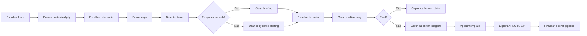

# Auditoria do Social Midia Studio

Data: 2026-06-30

## 1. Escopo

Superficie analisada: pagina `/social-midia-studio` do WAVY Dash.

Objetivo do usuario: transformar uma referencia viral do Instagram em um conteudo Wavy pronto para publicar, passando por pesquisa, copy, imagens e design.

Tipo de auditoria: fluxo, UX, acessibilidade visivel e arquitetura funcional. A analise combina capturas feitas nesta execucao com leitura do codigo da pagina, componentes, hooks e Supabase Edge Functions.

## 2. Modelo mental atual

O produto comunica cinco etapas, mas o fluxo real possui sete momentos: Scraper, Extracao de Copy, Pesquisa, Formato, Edicao da Copy, Imagens e Design. Reels desviam do fluxo depois da copy e terminam dentro da etapa visualmente chamada de `Imagens`.

## 3. Fluxo detalhado

### Etapa 0 - Controle de acesso

**Entrada:** sessao autenticada e papel do usuario.

**Processo:** `useRole()` consulta o papel. Enquanto carrega, a pagina fica vazia. Quem nao e administrador e redirecionado ao dashboard.

**Saida:** acesso ao Studio somente para administradores.

**Saude:** atencao. A protecao da tela existe, mas o estado de carregamento nao informa nada ao usuario.

### Etapa 1 - Scraper e selecao da referencia

**Entrada:** uma das quatro fontes.

- Minha Base: ate 10 perfis guardados no `localStorage` deste navegador.
- Por Tema: hashtag digitada pelo usuario.
- Link Direto: URL de um post.
- Top Viral Geral: posts dos perfis da base ordenados por visualizacoes.

**Processo:** `useViralScraper` chama a Edge Function `apify-scrape`. Ela usa o Instagram Post Scraper ou Instagram Hashtag Scraper da Apify, normaliza os dados e devolve posts mais o objeto bruto.

**Saida:** grade com perfil, formato, miniatura, trecho da legenda, visualizacoes, curtidas e acao `Usar como referencia`.

**Saude:** funcional, mas sobrecarregada. Na execucao havia 73 acoes iguais, sem filtro, ordenacao explicita, busca interna ou resumo da referencia escolhida.

### Etapa 1.5 - Extracao de copy

**Entrada:** post normalizado e, quando disponivel, objeto bruto retornado pela Apify.

**Processo:** `social-extract-copy` detecta o tipo do post.

- Reel: transcricao por `invideoiq/video-transcriber` na Apify.
- Carrossel: OCR sequencial de cada imagem pelo Google Vision.
- Post estatico: OCR da imagem pelo Google Vision.
- Todos: legenda e hashtags sao incorporadas a `copy_consolidada`.

**Saida:** transcricao, OCR por slide, legenda, hashtags, status de cada fonte e uma copy consolidada editavel.

**Saude:** fragil. Na evidencia capturada, um post que exibia legenda na grade chegou a extracao como `sem legenda`, `sem texto detectado` e `0K likes`. O botao de avancar permanece visualmente habilitado mesmo com copy vazia; a validacao aparece apenas depois do clique.

### Etapa 2 - Tema e pesquisa

**Entrada:** copy consolidada e post de referencia.

**Processo inicial:** se a copy tiver mais de 50 caracteres, `social-tema-gen` usa Claude Haiku para transformar o conteudo em um tema tecnico de pesquisa. Se falhar, usa as primeiras palavras da legenda.

O usuario pode:

- ajustar o tema e iniciar pesquisa;
- pular a pesquisa e usar a copy viral como briefing.

**Pesquisa completa:** `social-research` usa Claude Sonnet com busca web para criar um briefing de ate 400 palavras, pedindo dados recentes, tendencias, dores e exemplos.

**Saida:** briefing editavel ou um texto interno que marca `Pesquisa pulada`.

**Saude:** boa base, com controle humano. Falta mostrar fontes e separar fatos encontrados de recomendacoes do modelo, o que reduz confianca e verificabilidade.

### Etapa 3 - Formato e geracao da copy

**Entrada:** tema, briefing e copy viral.

**Processo:** escolha entre cinco familias narrativas.

- 1A/1B: carrossel direto.
- 2A/2B: carrossel narrativo.
- 3: Reel.
- 4: post frase.
- 5: frase mestre.

Carrosseis permitem escolher o numero de slides. `social-copy` envia o briefing para Claude Sonnet, aplica regras da Wavy Copy Skill e exige JSON estruturado.

**Saida:** slides ou cenas, legenda e hashtags.

**Edicao:** titulo e corpo de cada slide, cenas do Reel, legenda e hashtags podem ser alterados. Cada slide/cena pode ser reescrito por IA; tambem e possivel refazer tudo.

**Saude:** forte em controle editorial. A escolha de familia e clara, mas adiciona tres telas internas que nao aparecem no indicador principal. Nao ha comparacao entre formatos, estimativa de custo, historico ou desfazer.

### Etapa 4A - Imagens para posts e carrosseis

**Entrada:** slides aprovados, tema, padrao e ate 200 caracteres da legenda viral como estilo global.

**Processo:** uma heuristica local sugere um entre dez estilos visuais. Alguns estilos usam Gemini; outros exigem upload real. `social-image-gen` monta um prompt detalhado, gera a imagem e salva no bucket publico `social-media`.

**Acoes:** gerar individualmente, regerar, trocar estilo, fazer upload ou gerar lote.

**Saida:** uma imagem por slide com URL, fonte, prompt e estilo usados.

**Saude:** funcional, mas custosa e longa. O lote e sequencial, nao tem pausa, cancelamento ou retomada. Estilos de upload sao ignorados pelo lote, e a etapa inteira fica bloqueada ate todos os slides terem imagem.

### Etapa 4B - Saida de Reel

**Entrada:** roteiro aprovado, legenda e hashtags.

**Processo:** nao gera imagens nem video. Apenas organiza o roteiro.

**Saida:** texto copiado para a area de transferencia ou arquivo `.txt`.

**Saude:** incompleta em relacao a expectativa criada pelo nome Studio. O entregavel e um roteiro, nao um Reel produzido. Alem disso, ele aparece quando o indicador principal diz `Imagens`.

### Etapa 5 - Design e exportacao

**Entrada:** copy aprovada, imagens, identidade e template.

**Processo:** o padrao sugere um template, mas o usuario pode escolher qualquer um. O perfil social e carregado do Supabase. Os slides sao compostos em React e exportados com `html-to-image`.

**Saida:** PNG individual, ZIP com todos os PNGs e `legenda.txt`.

**Persistencia:** somente nome, handle, avatar e template padrao sao persistidos em `social_profiles`. As imagens ficam no Storage; o projeto e a copy final nao sao salvos como um trabalho recuperavel.

**Saude:** bom acabamento e exportacao pratica. O botao `Finalizar pipeline` zera imediatamente todo o estado, sem confirmacao e sem criar um registro do projeto.

## 4. O que funciona bem

1. O fluxo tem um objetivo claro: referencia, contexto, copy, imagem e arte.
2. Pesquisa, copy e identidade permanecem editaveis, mantendo o usuario no controle.
3. O sistema combina automacao com alternativas manuais, especialmente em imagens.
4. Os formatos Wavy possuem estruturas narrativas explicitas e coerentes.
5. A exportacao em ZIP inclui os slides e a legenda.
6. Existem estados de carregamento, mensagens de erro e opcoes de tentar novamente.
7. O visual e consistente com o restante do WAVY Dash.

## 5. Riscos de UX priorizados

### Critico - Saltos criam conteudo ficticio e quebram a confianca

O indicador permite clicar em qualquer etapa. `jumpTo()` preenche silenciosamente copy, briefing, slides e imagens com placeholders. Assim, e possivel chegar ao Design e exportar conteudo de configuracao como se fosse real.

**Recomendacao:** permitir voltar livremente, mas bloquear avancos sem requisitos reais. Para testes administrativos, criar um modo de demonstracao explicitamente identificado.

### Alto - Todo o trabalho pode desaparecer

O pipeline existe apenas em `useState`. Atualizar a pagina, fechar a aba, perder sessao ou navegar para outra rota elimina referencia, briefing, copy e selecoes. Finalizar tambem zera tudo.

**Recomendacao:** criar projeto persistente com autosave, status, data da ultima alteracao e opcao de retomar.

### Alto - A etapa oculta de extracao pode falhar sem contexto suficiente

A selecao de um post aciona processamento externo imediatamente. O usuario nao ve custo, tempo esperado ou quais dados serao extraidos. O resultado observado perdeu informacoes que estavam visiveis no card.

**Recomendacao:** mostrar um resumo da referencia, confirmar o processamento e permitir continuar usando somente a legenda quando OCR/transcricao falhar.

### Alto - O indicador nao representa o trabalho real

Extracao e edicao de copy nao aparecem como etapas. Reels terminam em `Imagens`, e `Design` deixa de fazer sentido para esse ramo.

**Recomendacao:** usar etapas orientadas a resultado: `Referencia`, `Contexto`, `Copy`, `Midia`, `Finalizar`. Subetapas devem aparecer dentro de cada uma.

### Alto - Pesquisa afirma usar dados reais, mas nao mostra fontes

O backend pede busca web recente, mas a resposta final devolve apenas texto. O usuario nao consegue verificar origem, data ou confiabilidade.

**Recomendacao:** retornar fontes estruturadas, exibir links e permitir remover uma fonte antes de gerar copy.

### Alto - Servicos caros nao mostram previsao nem protecao operacional

Apify, Google Vision, Claude e Gemini sao acionados em diferentes momentos. As Edge Functions analisadas nao fazem verificacao explicita do usuario ou do papel dentro da propria funcao.

**Recomendacao:** validar JWT e papel no servidor, aplicar limites por usuario, idempotencia, quota e estimativa de custo antes de lotes.

### Medio - Resultados virais sao uma parede de cards

Dezenas de posts aparecem de uma vez. Nao ha filtros por formato, perfil ou engajamento, nem ordenacao visivel. Metricas `0` podem significar dado ausente, mas parecem desempenho zero.

**Recomendacao:** adicionar filtros, ordenacao, paginacao e estado `dado indisponivel`. Exibir uma bandeja de referencia selecionada.

### Medio - A rolagem e mantida entre etapas

Ao saltar de Formato para Imagens, a nova etapa abriu no meio da grade, mostrando primeiro os slides 4 e 5. Isso oculta titulo, orientacao e acao principal.

**Recomendacao:** ao mudar de etapa, mover o foco e a rolagem para o titulo da nova etapa.

### Medio - Lote de imagens nao suporta recuperacao

As imagens sao geradas uma por vez. Nao existe pausa, cancelamento, fila persistente, retry apenas das falhas ou resumo de custo. Uploads obrigatorios impedem a aprovacao ate serem resolvidos.

**Recomendacao:** usar fila com estados por slide, `Gerar faltantes`, `Tentar falhas novamente`, cancelamento e aprovacao parcial consciente.

### Medio - Identidade salva a cada tecla

Cada alteracao de nome ou handle chama `save()` e faz `upsert` no Supabase. Ao mesmo tempo existe um botao `Salvar perfil`, criando duas expectativas conflitantes.

**Recomendacao:** editar localmente e salvar com debounce mais feedback, ou usar um unico botao de salvar com estado `alteracoes pendentes`.

### Medio - Finalizar significa apagar, nao concluir

`Finalizar pipeline` nao cria historico nem confirma que os arquivos foram baixados. Ele apenas mostra um toast e reinicia o estado.

**Recomendacao:** criar tela de conclusao com arquivos, copy, links, `Criar variacao`, `Duplicar projeto` e `Novo projeto`.

## 6. Riscos de acessibilidade

1. Botoes apenas com icone aparecem sem nome acessivel no DOM: adicionar perfil, remover perfil e alguns botoes de voltar.
2. Remover perfil e baixar PNG individual dependem de hover, dificultando teclado e toque.
3. Varias informacoes usam texto de 10 ou 11 px e branco com baixa opacidade sobre fundo preto.
4. Campos dependem de placeholder, sem rotulos programaticos persistentes.
5. Miniaturas e avatares usam `alt=""`; isso pode ser correto para decoracao, mas a referencia principal perde contexto para leitor de tela.
6. O indicador nao expõe `aria-current`, nem anuncia claramente conclusao e mudanca de etapa.
7. Toasts e carregamentos precisam de verificacao com leitor de tela e foco; screenshots nao confirmam anuncio adequado.
8. A captura mobile ficou visualmente reduzida e nao foi aceita como prova de responsividade. O reflow precisa ser validado em dispositivo real ou nova sessao de captura.

Nao e possivel afirmar conformidade WCAG apenas pelas capturas e leitura estatica. Teclado, foco, zoom, contraste calculado e leitor de tela ainda precisam de teste dedicado.

## 7. Arquitetura funcional

| Momento | Cliente | Servico | Modelo/ferramenta | Resultado |
| --- | --- | --- | --- | --- |
| Buscar viral | `useViralScraper` | `apify-scrape` | Apify Instagram Scraper | posts normalizados + raw |
| Extrair copy | `CopyExtractionStep` | `social-extract-copy` | Apify Transcriber / Google Vision | OCR, transcricao, legenda |
| Detectar tema | `ResearchStep` | `social-tema-gen` | Claude Haiku | tema tecnico |
| Pesquisar | `ResearchStep` | `social-research` | Claude Sonnet + web search | briefing |
| Gerar copy | `FormatStep` | `social-copy` | Claude Sonnet + Wavy Copy Skill | slides/cenas + legenda |
| Reescrever | `CopyEditor` | `social-copy` | Claude Sonnet | slide/cena revisado |
| Gerar imagem | `ImageStep` | `social-image-gen` | Gemini Image + Wavy Image Skill | imagem no Storage |
| Montar arte | `DesignStep` | navegador | React + html-to-image + JSZip | PNG/ZIP |

## 8. Direcao recomendada para o novo fluxo

### Fase 1 - Integridade e seguranca

1. Remover avanco livre com placeholders.
2. Persistir projeto e autosave.
3. Proteger Edge Functions e aplicar quotas.
4. Transformar `Finalizar` em conclusao persistente.

### Fase 2 - Clareza do processo

1. Reorganizar em cinco etapas orientadas a resultado.
2. Exibir referencia selecionada e dependencias da etapa.
3. Mostrar custo, tempo e estado de cada chamada externa.
4. Exibir fontes da pesquisa.

### Fase 3 - Eficiencia de producao

1. Filtros e ranking de virais.
2. Fila recuperavel de imagens.
3. Historico e variacoes de copy/imagem.
4. Tela final com todos os entregaveis.

### Fase 4 - Acessibilidade e responsividade

1. Nomes acessiveis, rotulos e foco.
2. Acoes sempre visiveis em toque e teclado.
3. Contraste e tamanho minimo de texto.
4. Teste mobile real e navegacao completa por teclado.

## 9. Evidencias

1. `01-entrada-scraper.png`: entrada e lista de virais. Saude: atencao.
2. `02-extracao-copy-vazia.png`: extracao sem OCR/legenda. Saude: fragil.
3. `03-pesquisa-tema-detectado.png`: tema gerado e escolha pesquisar/pular. Saude: boa.
4. `04-escolha-formato.png`: cinco familias narrativas. Saude: boa.
5. `05-preparacao-imagens.png`: nova etapa aberta mantendo rolagem anterior. Saude: problema confirmado.
6. `06-imagens-topo.png`: configuracao e geracao de imagens. Saude: atencao.
7. `07-design-exportacao.png`: templates, identidade e exportacao. Saude: boa com risco de perda.
8. `08-reel-configuracao.png`: ramo de Reel antes da geracao. Saude: atencao.
9. `09-entrada-mobile.png`: captura mobile inconclusiva por escala anormal do navegador; nao usada para conclusao visual.

## 10. Limites da auditoria

- Nao foram disparadas geracoes pagas de briefing, copy ou imagem apenas para auditoria.
- O ramo de Reel foi inspecionado ate a confirmacao anterior a geracao e completado por leitura do codigo.
- Nao foi feito teste com leitor de tela.
- Nao foi medido contraste por ferramenta automatizada.
- A captura mobile foi inconclusiva e deve ser repetida antes de alteracoes responsivas.
- A pagina analisada estava autenticada como administrador e continha resultados de busca ja carregados.
